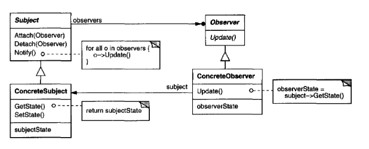

# Observer Pattern
According to Design Patterns, the intent behind the design is described as: to "define a one-to-many dependency between objects so that when one object changes state, all its dependents are notified and updated automatically".

**Also Known As**: Dependents, Publish-subscribe

## Why is this needed?
Whenever an object relies on another, the dependee may change. This could cause dependents to act improperly, as if they are not aware of the changes, their behavior may no longer function as intended.  

## Design

 The observer detects state change in the subject by being attached via method. 

 The subject can attach any number of observers to itself. The observer stores state consistent with the subject's.

 *Query:* How do you go about implementing the ability for an update method to be run for every observer? How do you determine what data is passed to them?
*Answer*: The subject doesn't pass the data, the observer queries for it.

 According to the book the subject and observer are only aware of the interface of the other, which allows for the concrete implementation to differ. Makes sense. 

 One of the concerns mentioned in the consequences section says that because observers have no knowledge of each other, they can change the subject in a way that could unexpectedly change something.

 To me, this speaks to a misunderstanding I had at the start: The observer pattern is more about allowing an open "interface"(not literally) between classes for communicate without knowledge about the other's structure. The advantage of this is that you can update the implementation of the concrete classes without breaking any of the structure inherently.

## After Testing
I want to do the example where you specify an aspect of interest for the Observer as it's being attached.

One of the annoying aspects of the Observer, is how do you handle the references to each other?
In TypeScript, interfaces can not have static variables, so you pretty much need to use abstract classes to do it. Which is a bit of a shame,  I would've liked to use interfaces for that... I suppose the best way to utilize this pattern with this limitation is creating an abstract class that implements the interface and build the class out of it. One of the value adds of this design pattern is that you can apply the interface to any class to allow it to watch a concrete subject class. At the end of the day, it's not terribly awful that the static variables aren't allowed in the interface, as the getters and setters are publicly accessible and thus can exist in the interface.